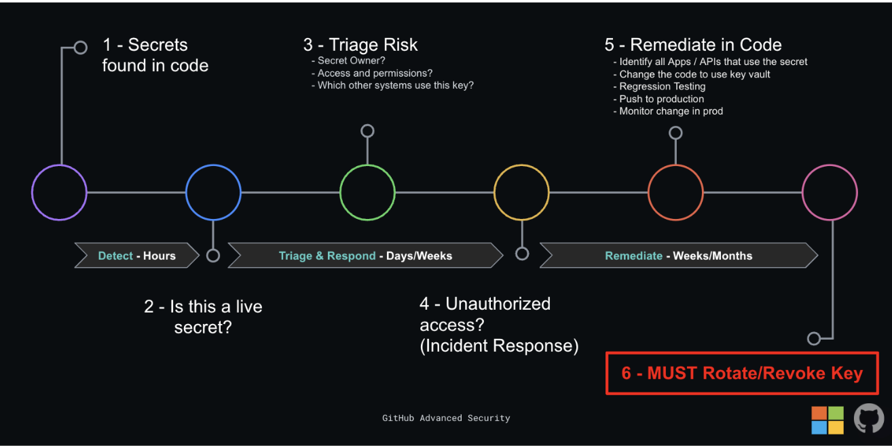
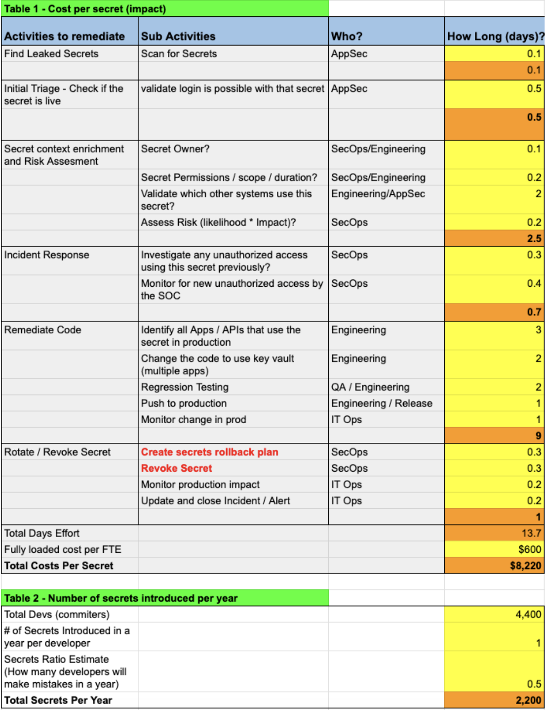
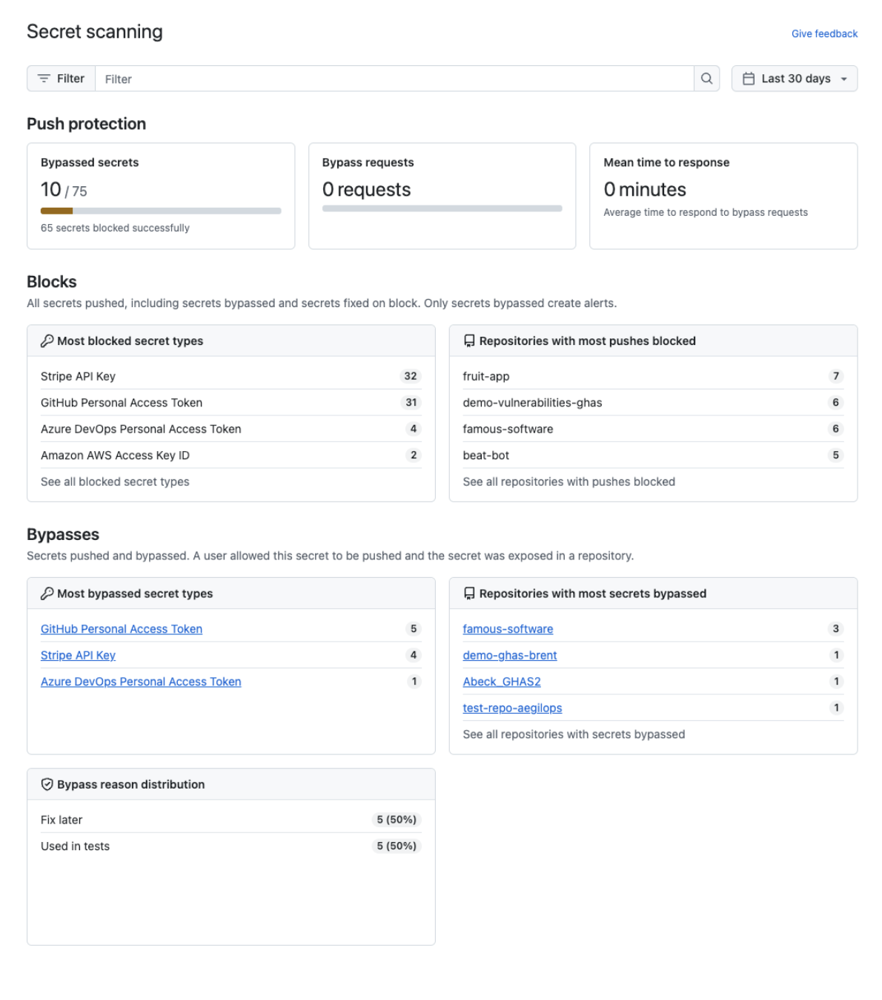

# **The true cost of remediating leaked secrets in code**

Version 1.4  
5 September 2024

Shlomi Shaki,  @Sentry01   
GitHub Copilot GTM Lead, Asia Pacific & Japan  

## **Introduction**

In today’s digital age, the security of sensitive systems and information is more important than ever. With the rise of cyberattacks and data breaches, it’s crucial for organizations to take proactive measures to protect their systems from unauthorized access through stolen credentials and secrets that were left in plain sight. 

The real cost of remediating leaked secrets is often misunderstood or underestimated by engineering and security teams alike. The purpose of this document is to raise awareness to the hidden costs and activities that are associated with mismanaged secrets in repositories or code. 

Through research and conversations with a number of large enterprise organizations, the remediation of secrets often takes a number of days through to weeks and could cost an estimated [$3,000-$16,000 per secret remediation](https://sentry01.github.io/Secret-Remediation/#the-cost-of-remediation)

In this brief, we will discuss the importance of proper secret management to prevent leaks and the steps that organizations need to take when they find a secret in the code. 

## **What are secrets?**

Secrets are sensitive pieces of information that should be kept confidential. They can include passwords, API keys, and other credentials that are used to access systems or services. Secrets are often stored in code repositories, issues, discussions, or configuration files, making them vulnerable to unauthorized access through accidental or malicious activities.

## **Why is secure secret management important?**

Secure secret management is important and is imperative to prevent unauthorized access to sensitive information. Unfortunately, many developers fail to use proper secret management practices despite knowing that hardcoding passwords or secrets is risky. Secrets that are not properly managed can be exposed accidentally or maliciously to attackers who can then use them to gain access to systems or services. This could result in data breaches, financial loss, reputational damage, and even loss of lives. Credential theft and exploitation are often the most common attack vectors.

## **General best practices for secure secret management**

Here are some of the most common best practices for secure secret management:

1. **Security awareness:** providing security awareness to engineers is the first and most effective line of defense.  
2. **Use a secret management service or tool**: use a secret management tool like Azure Key Vault or HashiCorp Vault to store secrets securely.  
3. **Scan for known secrets in repositories, discussions or issues:** use GitHub’s secret scanning tool to scan for known and custom secret patterns \- this is free for all public repos. To learn more: [About secret scanning \- GitHub Docs](https://docs.github.com/en/code-security/secret-scanning/about-secret-scanning)  
4. **Activate push protection:** apply GitHub’s push protection to systematically and consistently alert developers from accidentally including hardcoded secrets in the code repositories or in GitHub Issues. To learn more: [Push protection for repositories and organizations \- GitHub Enterprise Cloud Docs](https://docs.github.com/en/enterprise-cloud@latest/code-security/secret-scanning/push-protection-for-repositories-and-organizations)  
5. **Consider pre-commit checks:** Pre-commit checks help catch secret leaks at the IDE or local machine before the secret traverse the network, however can be challenging to scale in large organizations.   
6. **Rotate secrets regularly**: rotate secrets regularly to reduce the risk of exposure. [This is an example of GitHub’s recommendations around account security](https://docs.github.com/en/enterprise-cloud@latest/authentication/keeping-your-account-and-data-secure/managing-your-personal-access-tokens)  
7. **Limit access and time usage**: limit access to secrets to only those who need it as well as apply “least privilege” concepts to limit the access that the secret grants.  
8. **Monitor access**: monitor access to secrets and audit logs regularly to detect any unauthorized access.  
9. **Optional \- using deception:** consider using secrets that have been revoked as tokens for a honeypot to detect when those were exposed.

Detailed best practices on managing secrets are out of scope for this document, however, more can be read on this topic from OWASP here: [Secrets Management \- OWASP Cheat Sheet Series](https://cheatsheetseries.owasp.org/cheatsheets/Secrets_Management_Cheat_Sheet.html). You can also read more from Microsoft Azure Key Vault here [Best practices for secrets management in Key Vault - Microsoft Learn](https://learn.microsoft.com/en-us/azure/key-vault/secrets/secrets-best-practices).

## **I found a secret in the code repository \-  now what?** 

Once secrets have been detected in your code by a secret scanning tool like GitHub Advanced Security’s secret scanning, they ultimately *must* be revoked/rotated, although there are a number of other activities that need to be taken into account. Once detected, time is of the essence as the secret may further spread and malicious attackers may be able to use that secret to gain unauthorized access to key infrastructure and cloud assets to establish a foothold and move laterally.

Dealing with secrets that were found in your code and repositories is often misunderstood, underestimated, and undocumented. Often, developers believe that removing those from the code itself is sufficient but forget that the secret may have already been accessed or leaked, as well as the fact that they still exist in the Git history and could leak out if the entire repository was cloned.

The diagram below shows an **example** process flow to handle secrets that are found. Note the time and effort each step takes. Shifting left to eliminate those mistakes will save considerable time, costs, and effort in remediation. 

**Note: Many of the steps below should happen in parallel. Some of those steps are almost always cyclical (such as re-validating, testing, and remediating multiple apps in case of shared secrets)** 

## **Considerations to make before removing an existing secret from the code**

Removing secrets from code and Git history can be complex and has many considerations. Here are some of the challenges that organizations may face when implementing secret removal:

1. **Impact on services:** when secrets are revoked, they could impact services that depend on them and lead to service disruptions and downtime. It is important to keep the old and potentially compromised secret safe in case you need to roll back.  
2. **Clarity:** there can be lack of clarity on the access the secret has, who owns it, and if it has been rotated or revoked in the past.  
3. **Coordination:** coordinating secret removal across multiple teams and services can be challenging. It requires careful planning and communication to ensure that all teams are aware of the changes and can update their systems accordingly.  
4. **Compliance:** compliance requirements such as [PCI-DSS](https://www.pcisecuritystandards.org/) and [GDPR](https://gdpr.eu/what-is-gdpr/) mandate periodic secret removal. Organizations need to ensure that they are meeting these requirements while also minimizing the impact on their services.  
5. **Security:** secret removal can introduce new security risks if not done properly. For example, if secrets are not removed from all locations where they were used (for example, Git history or local copy of the code), but are still live and not rotated they can still be exposed to attackers who can use them to gain access to systems or services.  
6. **Git history:** Removing secrets from Git history can be challenging because Git is designed to keep a complete history of all changes made to a repository. This means that even if a secret is removed from the latest version of the code, it may still exist in previous versions of the code.  
7. **Auditability:** organizations need to be able to audit secret rotation to ensure that it is being done properly and in compliance with regulations.

**Detailed steps to take once a secret is found in the repository:**

1. **Determine if this is a live secret.** Secrets are only a risk to the organization if they are still live and have not been rotated or revoked. The first step is to ascertain whether the secrets are still in use. Tools like [GitHub Advanced Security can automate validity checks of secrets.](https://github.blog/2023-10-04-introducing-secret-scanning-validity-checks-for-major-cloud-services/)  
2. **Triage and assess risk.** Organizations need to have a documented triage process to ascertain the risk level of that secret. To make an informed risk assessment, you need to enrich information about the use of the secrets and find out information about the access the secret has, who owns the secret, what systems rely on that secret, the criticality and business value of those systems, and the classification of those systems.  
3. **Trigger incident response process.** Once a secret is detected in the code, repository or Git history, organizations need to assume that an attacker (insider or malicious outsider) may have had access to that secret and may have abused its access unauthorized. It is recommended to start an investigation and monitoring process and validate that all access using that secret was legitimate. This process should run simultaneously to the remediation of the secret.  
4. **Remediate the code of *all* dependent systems.** Engineers and Security teams must get together to provide a patch for the applications or systems that are affected by the hardcoded secrets and to use a more secure practice to authenticate.  
   Removing the hard-coded secret from the code is not sufficient, as it may already have been leaked and must be revoked. The secret will also be available in the Git history (saved in every other version of the software). Removing those secrets from the Git history is a complex and dangerous process\! If you still decide to remove this from the history, [organizations should consider using tools like git filter-repo or BFG Repo-Cleaner to remove secrets from Git history](https://docs.github.com/en/authentication/keeping-your-account-and-data-secure/removing-sensitive-data-from-a-repository). These tools rewrite the repository’s history, which changes the SHAs for existing commits that you alter and any dependent commits. Changed commit SHAs may affect open pull requests in your repository. We recommend merging or closing all open pull requests before removing files from your repository.  
5. **Rotate or revoke the secret**. Once the systems are using a safe authentication mechanism, you can revoke the previous exposed access key.  
6. **Investigate**: Investigate how the secret was added to the code repository or configuration file and take steps to prevent it from happening again.  
7. **Optional \- leverage for deception**. Potentially use the innocuous secrets or canary tokens in the code for honeypots or deception tactics.  
   

## **The cost of remediation**

There are numerous costs associated with hardcoded secrets, including the risk assessment, investigation, code remediation, auditing, and in unfortunate cases where the leaked secret has been exploited, the costs associated with a breach.

In order to help quantify the cost to remediate each secret, we need to calculate the effort of [each remediation step](#bookmark=id.ov4yklcvht9m) (in FTE days) and multiply it by daily fully loaded cost per day.

**Remediation costs per one secret \= effort to remediate the secret \* fully loaded daily rate** 

The cost of remediation usually grows exponentially with the size and complexity of the organization. As such, we need to make a distinction between large complex enterprise organizations and smaller organizations.

At an estimated US$640 fully loaded cost per engineering day smaller organizations could spend around $1,600 on average per leaked secret (provided it has not been used in multiple apps) and in large complex organizations this could escalate to $3,200-$16,000 on average. [See the total economic impact by Forrester](https://resources.github.com/forrester/#form)

**Complex enterprise organizations:** (more than 1,500 engineers)   
Estimated between 5 \- 25 FTE days of remediation effort per secret found \* $640 per day

**Cost to remediate a single secret \= $3,200-$16,000**

**Small organizations:**  
Estimated between 0.5 \- 5 FTE of remediation effort days per secret found \* $640 per day

**Cost to remediate a single secret \= $320- $3,200**

Below is a simple secret remediation cost calculator example:

Notes:

* Organizations that have not automated the process well and do not have an automated system to deal with rotation and all the complexities involved in it, may find that performing a true risk assessment may take days, and identifying service impact may take even longer.   
* Code remediation may potentially take days or even weeks as it depends on the availability of engineers and access to the code, instances of the code in various systems, and is subject to change freezes.   
* Additional costs and reduced productivity need to be attributed to remediation efforts due to various engineering and security teams needing to leave project delivery work and focus on remediation efforts.  
* Small and nimble organizations may be able to remediate secrets within a few hours or days  
* Cost avoidance potential can be calculated by measuring how many secrets were prevented from being leaked by providing “in flow” security awareness to developers as they are about to make a mistake.

The below screenshot from GitHub’s security overview demonstrates the amount of secrets that have been successfully blocked before they ever manage to leak into the Git history and repository, allowing organizations to avoid the associated potential secret remediation costs.

**How do I stay clean:**

Organizations can avoid the most common mistakes pertaining to secrets and therefore avoid costly and lengthy remediation, by applying good security awareness practices to the developers, and ensuring policies for secure secret management are being followed. 

In addition, we recommend organizations activate GitHub’s (or Microsoft’s ADO) push protection to alert developers from accidentally including hardcoded secrets in the code repositories or in GitHub Issues. Consider [delegated bypass for push protection](https://docs.github.com/en/enterprise-cloud@latest/code-security/secret-scanning/using-advanced-secret-scanning-and-push-protection-features/delegated-bypass-for-push-protection/about-delegated-bypass-for-push-protection) to add another line of review and defense.

To learn more:  [Push protection for repositories and organizations \- GitHub Enterprise Cloud Docs](https://docs.github.com/en/enterprise-cloud@latest/code-security/secret-scanning/push-protection-for-repositories-and-organizations)

## **Conclusion**

Secure secret management is critical for protecting sensitive information from unauthorized access. By following best practices for secure secret management and taking proactive measures when secrets are found in code, organizations can reduce the risk of data breaches and reputational damage whilst also avoiding unnecessary remediation and investigation costs due to leaked secrets.

Finally, it is exponentially cheaper to prevent the secrets from ever being hardcoded, than to remediate them after the fact. 
